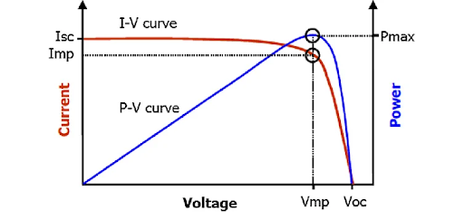
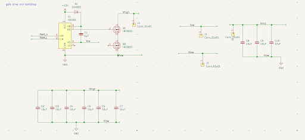
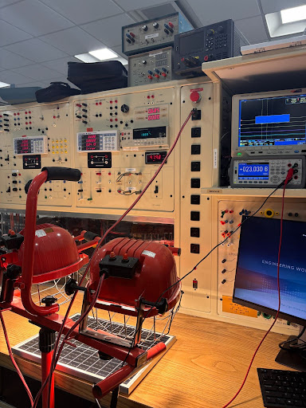

# Sandra's Lab Notebook — Solar Scrubber (ECE 445, Project #57, Spring 2026)

**Author:** Sandra Georgy
**Team:** Yehia Ahmed, Sandra Georgy, Jonathan Sengstock
**Professor:** Joohyung Kim
**TA:** Chihun Song

---

## Overview of My Responsibilities

Within the Solar Scrubber project, my primary subsystems are:

1. **Solar panel sensing interface**: three voltage dividers for voltage sensing (one per panel) followed by OPA376 unity-gain buffers, plus a current sense amplifier across a 10mohm resistor.
2. **DC-DC buck converter**: including the IR2181 (only using high side) and the bootstrap circuit that drives the IRF6665 N-channel MOSFETs, used as the dynamic load for MPPT.
3. **MPPT (Perturb-and-Observe) algorithm**: running on the ESP32, processes the voltage and current sampling to see which panel outputs the lowest power to clean. The MPPT algorithm outputs the duty ratio for the buck converter based on the output power sampled from each panel. Duty ratio in code is limited to 50% because beyond that, panel voltages collapse (negative voltages).
4. **Support tasks**: motor driver bring-up (L298N + stepper), ECE 469 buck converter validation, and PCB integration with Yehia and Jonathan.

The narrative below is built from my handwritten notebook entries, week by week.

---

## 2026-02-09 — MPPT vs. voltage sensor alone

**Objective:** Prepare questions for our upcoming meeting with Professor Stillwell and research characteristics of solar panels.
1. voltage dividers vs op-amps?
2. MPPT algorithm (P&O)
3. Use ECE469 board as a buck converter or build our own?
4. Use LDOs or buck chips




*Figure 1: I-V Curve of a Solar Panel*

The case for full MPPT is that it gives us a real power number to compare across panels, not just a voltage so we can tell if the panel is just shaded or dirty

**Decision:** go with full MPPT (Perturb & Observe), use ECE469 buck for early testing, and place panels in series (three voltage measurements + one current measurement).

---

## 2026-02-16 — Professor Stillwell meeting + group meeting

**Objective:** Review power-side architecture and divide PCB ownership inside the team.

Notes from Professor Stillwell:

- Use the ECE 469 board for the buck converter to start.
- Recommended layout: 3× voltage sense + 1× current sense, series configuration for the panels.
- Recommended ICs:
  - Use the same current sense chip from 469 board (INA24181)
  - Look into ECE469 Schematics to use similar parts (good starting point)
- He sketched a topology with the shunt at the bottom of the string and a buffered voltage tap at each panel boundary.

**Group meeting — PCB ownership:**
- Me: sensors (sensors: voltage divider × 3, op-amp buffers × 3, current sense amp, plus the buck)
- Jonathan: general layout, USB, motor controller
- Yehia: MCU and power tree

---

## 2026-02-19 — TA meeting

**Objective:** Catch up with Chihun on logistics.

Two things:
- $10 minimum for parts ordering.
- **PCB ordering deadline: 2/26.** That gives us one week for layout from today.

---

## 2026-02-24 — Stillwell meeting (PCB review)

**Objective:** Review schematic with Professor Stillwell

Key feedback:

- Confirm USB-to-MCU works.
- Current sense resistor should be smaller (~10 mΩ) — I had it sized too high (done)
- Use a chip with a higher gain (50V/V) for the current sesne IC (done)
- Add a jumper resistor between the op-amp input and output so we can bypass the op-amp if it doesn't work (done)
- Reference voltage sense to ground
- Add a gate resistor for the high side mosfet
- Inductor: use one from the power lab (done)
- Ensure CCM operation 

I also drew the input/output schematic with three voltage sense points and the current ammeter at the bottom of the string for the PCB review walkthrough (shown below)

**MCU inputs I'm responsible for routing into:**
- 3× voltage sense
- 1× current sense
- 2× light sense
- USB (for data)
- encoder

---

## 2026-02-26 — PCB submitted (round 1)

**Objective:** Get the first PCB ordered before deadline.

Submitted the round-1 PCB. I excluded the buck converter because we decided to use the ECE 469 power board for early testing. I will be including the buck schematic 
- Light Sensors: Yehia made a good point that we don't need the light sensors because we can code baseline numbers in the code that can be updated regularly

**PCB review notes from Chihun (acted on or noted):**
- 3.3 V → 5 V level shift for motor drivers.
- Bypass capacitor on each rail.
- Larger cap (2.2 µF) on the MCU 3.3 V pin.
- Add filter on op-amps. (done)
- 3.3 V to op-amps. (done)
- Capacitor in parallel to (the divider midpoint).
- Add 32 kHz crystal. (done)
- Connector for motor driver(s).

---

## 2026-03-03 — Design doc week

**Objective:** Finish and present the design document.

Most of the week was the design-document presentation to Chihun and Prof. Kim.

**Notes:**
- Make sure PCB is enclosed within a box so it can be protected from the sprayer


---

## 2026-03-10 — ECE 469 power board

**Objective:** Make sure we can configure ECE 469 board as a buck converter and start configuring our MCU to ouput the PWM (worked)


**Note:** for the breadboard demo, we will be using an ESP32-C3 Super Mini because the lab is out of S3 chips.

**Testing for the buck converter:**
- Vin = 10 V
- PWM 0–5 V, f = 100 kHz, D = 0.5
- Rgate = 40ohms
- Vout = 4.9 V (measured, buck behavior confirmed)

---

## 2026-03-13 — PCB round 1 arrived

**Objective:** Inspect the PCB and identify problems for round 2.

Picked up round-1 PCB from senior design lab and I started working on the buck schematic so we can include it in the next round 



*Figure 2: Buck Converter Schematic*

**Observations:**
- Connection to the 469 board: the footprint is too small for the pin header I planned to use. use a bigger footprint for the next round (Jonathan - layout)
- Banana jacks for the solar panel inputs are too close to each other so we need to spread them out more

---

## 2026-03-14 — Parts order

**Objective:** Submit the SMD parts order.

Parts order submitted for SMD components.

---

## 2026-03-31 — Solar panel characterization (3 panels)

**Objective:** Characterize each panel to find its Voc (open circuit voltage) and Isc (short circuit current). Each group member tested one panel.



*Figure 3: Solar Panel Testing*


Two takeaways:
1. Even though panel 1 and 2 are the exact same, they had slightly different Voc and Isc
2. Panel 3 had the highest Voc and Isc but it had similar power characteristics as panels 1 and 2.

### Stepper motor test (same session)

While I had the bench set up, helped get the stepper driver wired:

| Pin | Setup |
| --- | --- |
| PUL+ | 0–5 V square wave, 50% duty, **4 kHz** |
| PUL- | GND |
| DIR+ | GND |
| DIR- | GND |
| ENA+ | not connected |
| ENA- | GND |
| Control | 5 V |
| GND / +VDC | 0 V / 24 V |

DIP switches (1–8): off, on, off, on, off, on (positions 7 and 8 not noted — likely off).

Coil colors confirmed: **A+ red, A− blue, B+ green, B− black.**

---

## 2026-04-14 — Buck converter bring-up on extra PCB (the MOSFET smoking incident)

**Objective:** Bring up buck converter on a separate PCB using a signal generator and an external power supply


### Test 1: Rout = 8 ohms, switching signal 3.3 V p-p, f = 100 kHz, 50% duty

- Vin = 10 V, Iin = 0.41 A
- switch started smoking
- Killed the bench immediately.

**Diagnosis:** FET was killed because current exceeded its current rating. increase load to decrease output current.

### Test 2: Rout = 15 ohms, same switching signal

- Vin = 12 V, Iin = 0.31 A
- Vout = 6.536 V, Iout = 0.47 A
- Switch did not fail. Converter confirmed working.

The Vout is roughly D·Vin minus losses (12 · 0.5 = 6 V, measured 6.54 V — a bit high, suggesting we're slightly off pure-buck behavior because of the gate-drive timing, but it's stable).

---

## 2026-04-19 — Program MCU
**Objective:** Be able to upload code to the MCU and reset it.

We realized we had a resistor near the boot pin which was preventing us from uploading code. I de-soldered that resistor and shorted directly across the resistor pads to upload code. For actually running the code, I had to reset it by unplugging and plugging my laptop.

MCU was able to be programmed by end of morning.
---

## 2026-04-21 — Code upload fix, level shifter, motor on the array (the smoking 24 V jack incident)

**Objective:** start integrating MCU with the cleaner mechanism.

Done today:
- Uploaded sample code to verify serial output. (done)
- Fixed the level shifter.
- Moved the horizontal motor on the array cleaner back and forth 

### Voltage scaling math (so the firmware can recover panel voltages from buffered sense voltages)

With panels in series, the sense pins read the *cumulative* string voltage at each tap:

```
V_S1 = (1 / scale_v1) · V_P1                   -> V_P1 = V_scale_V1 · V_S1
V_S2 = (1 / scale_v2) · (V_P1 + V_P2)         ->  V_P2 = V_scale_V2 · V_S2 − V_P1
V_S3 = (1 / scale_v3) · (V_P1 + V_P2 + V_P3)
```

These voltages are used by MPPT to flag dirty panels.

### The 24 V barrel jack incident

When we tried to connect the solar panels and shine light on them, the 24 V barrel jack started smoking. Disconnected immediately. Diagnosis: the 24->12 V LDO (L7812) was shorted.

we believe it was a soldering issue so we replaced the 24V barrel jack. all bus voltages are stable.

---

## 2026-04-22 (morning) — String voltage with load: panels in series problem

**Objective:** Run the panels in series into a real load and see how the panels behave

**No-load (indoor lab conditions):**
- V_P1 = 6 V
- V_P2 = 2.5 V
- V_P3 = 6.5 V
- Sum = 15 V

Due to uneven lighting conditions, we realized that when all 3 panels are in series, one gets reverse biased since we don't have bypass diode. The total voltage was dropping to negative sometimes and we had to fix our lab setup to prevent that. Another fix in the design would be to add bypass diodes.


**With halogen lamp on:**
- No-load string ≈ 25 V.
- Drops to 7 V when we connect the external L and R for the buck converter.

### Test with buck under load running MPPT code

- R = 50 Ω, L = 300 µH
- Under halogen lamp, Vstring = 6 V
- Vout = 2.25 V
- Removed one of the two halogen lights: Vout = 1.2 V

The numbers are smaller than expected because the panels voltages are collapsing. However, with moving the lamp to an optimal location, we were able to prevent that.
---

## 2026-04-22 (afternoon) — Motor testing and the brush-motor

**Objective:** Calibrate motor speed in inches per second so we can write the timing for one panel coverage; bring up the brush motor.

### Stepper speed

- 6400 steps/revolution, 4000 Hz, 50% duty
- → **7.5 in / 3 s = 2.5 in/s**

For one 13 × 22 inch panel:
- Horizontal sweep: 13 in / 2.5 = **5.2 s**
- Vertical sweep: 22 in / 2.5 = **8.8 s**

These numbers go straight into the cleaning cycle code.

### Brush motor
The brush motor takes the 12V from the 24V->12V LDO to spin. When we tried to connect it, the LDO smoked agian. We then realized that the brush motor is pulling more current than the LDO can deliver. The LDO's rating is 1.5 A; the DC motor is pulling more than that.

We decided to not use the brush motor for that reason since the LDO wasn't rated for the high current. Another fix if we had more time would be to use a buck chip that's more efficient and can handle more current.
---

## 2026-04-22 (evening) — Solar panels sense ratio calibration

**Objective:** Calibrate sensor measurements for solar panels to feed into MCU (ensure < 3.3V)

| Measurement | Value |
| --- | --- |
| V₁ – GND (Panel 1 alone) | 0.32 V |
| V₂ – GND (Panels 1 + 2 stacked) | 18.33 V |
| Panel 3 | not tested — step-down resistor still needed (24 V Voc rated, not 12 V like the others) |

**At the MCU pins (after divider + buffer):**
- Pin 1 to MCU: 0.912 V
- Pin 2 to MCU: 0.734 V

**Ratios computed:**

```
V1_sense / V1_panel              = 0.912 / 10.32  ≈  0.08837
V2_sense / (V1_panel + V2_panel) = 0.734 / 18.33  ≈  0.04004
```

In firmware I use:

```
V1_panel = V1_sense / 0.08837
V2_panel = V2_sense / 0.04004 − V1_panel
V3_panel = V3_sense / scale_v3 − V1_panel − V2_panel
```

The schematic in my notes shows the three panels in series with sense taps at V₁, V₂, V₃ above ground; the ratios are exactly what falls out of that topology.

---

## 2026-04-25 — Buck under MPPT control: duty/Vout sweeps

**Objective:** Run the integrated buck under MPPT control with real panel input and log the operating points the algorithm settles on.

**Function-gen reference (for comparison):** 25% duty, 3.3 V, 50 kHz PWM:
- Vin from panels = 8.2 V
- Vout to resistors = 1.68 V

(That's about 0.20·Vin — slightly under D=0.25 because of FET and gate losses.)

**MPPT-controlled, first run:**
- Vin from panels = 15.3 V
- Vmid (out) = 1.6 V
- Algorithm settles in **D ≈ 0.07–0.09** range

**MPPT-controlled, second run:**
- Vin from panels = 18 V
- Vout = 3 V
- Algorithm settles in **D ≈ 0.185–0.20** range

Both runs show the algorithm finding a low-duty operating point — the panels are far from being heavily loaded indoors, and the MPP sits at low duty. The fact that the duty is *consistent* run-to-run for similar Vin tells me the loop isn't drifting.

---

## 2026-04-26 — Cleaning code working, sprayer inrush problem

**Objective:** Tie the MPPT-flagged dirty-panel detection into the cleaning routine, end-to-end.

**Cleaning code working!** Trigger condition: detect a power loss of **50% between data point readings** on a given panel → fire cleaning cycle on that panel.

(Worth noting: our design-doc spec was 25% drop. We bumped the trigger threshold to 50% because at 25% we got false positives every time a hand or a notebook briefly shadowed a panel during testing. 50% is empirically robust to that kind of transient.)

### Sprayer inrush problem

Bad news: the water sprayer pulls up to 0.9 A inrush current, which is too high for our rated switch current on the PCB. We do not think we can drive the sprayer for the demo.

Mitigation for tonight: I disassembled the sprayer and removed the wires connecting it and the brush motor to the chassis, so we can demonstrate the dirty-panel detection and the gantry motion cleanly without risking another smoking component. Future fix would be a high-side power switch with a higher current rating, or a hold-in / inrush-limiting circuit.

---

## 2026-04-27 — Mock presentation feedback

**Objective:** Capture feedback from mock presentation for the final.

Feedback collected:

- **Highlight differences** between our project and Cameron's project rather than similarities. Remove "similarities" slide.
- Add more detail (graph) to the objective slide. Fewer words.
- Add a **table of successes vs. things we couldn't get working** (for partial credit). The sprayer inrush issue goes here.
- Add a table of contents / overview / summary at the beginning.
- For every problem/issue, add a **future fix.**
- Trim the requirements list to a key 2–3.
- **Demo:** break down each subsystem into criteria → point-max each one.

Action items for me: write up the buck converter MOSFET failure (Test 1 → Test 2 fix) and the LDO incident with the brush motor as the "issue → future fix" entries. The MPPT/dirty-panel side goes in the success column.

---

## 2026-04-28 — Final demo

**Objective:** Final demo.

**Demo today and it went well.** We showed off:

- **Dirty-panel detection** on the per-panel sensing chain.
- **Time-based cleaning cycle**, set to 1-minute intervals for purposes of the demo (in real deployment this would run on multiple-day intervals).

Sprayer was disconnected per yesterday's call — the rest of the system worked end-to-end. Gantry navigated to the flagged panel, brush actuated, MPPT continued to track the string before/after.

**Next:** collect more data and prepare for Q&A on **April 30** (presentation day).

---

## Closeout reflections

Looking back at the semester, the design choices that mattered most for my subsystems:

1. **Series wiring of the panels** (per Dr. Stillwell, 2/16). Made the single-shunt current sense work cleanly. The cost was the negative-panel-voltage failure mode under load (4/22), which I had to mitigate in firmware with the per-panel comparison + 50% threshold, not just look at string current.

2. **Using the ECE 469 board first as our buck**, then bringing up an integrated buck on an extra PCB (4/14), then on the main PCB. The MOSFET smoking on Test 1 of 4/14 was painful but caught a real layout problem early — pushing it on the main PCB first would have cost us a board.

3. **Pulling the LDO out of the brush motor power path** (4/22). Sharing a regulator between motors and logic was always going to fail; we just learned it the destructive way.

4. **Bumping the dirty-panel trigger from 25% to 50%** (4/26). The design-doc spec was tighter than reality. Real lab lighting fluctuates more than that on its own.

The final demo numbers I'd quote: MPPT loop settles to a stable operating duty within seconds of an irradiance change, dirty-panel detection fires correctly on a real obstruction, gantry positions to the flagged panel and runs the brush.

---

## Key Equations Used (Reference)

| # | Equation | Where |
| --- | --- | --- |
| 1 | `V_sense = V_panel · R_bot / (R_top + R_bot)` | Voltage divider (2/24) |
| 2 | `V_P1 = V_scale_V1 · V_S1`<br>`V_P2 = V_scale_V2 · V_S2 − V_P1`<br>`V_P3 = V_scale_V3 · V_S3 − V_P1 − V_P2` | Series-string sense decode (4/21) |
| 3 | `Voc · R_top(1+x) / [R_top(1+x) + R_bot(1−x)] < 3.6 V` | Resistor tolerance bound (design doc) |
| 4 | `C_boot > Q_g / ΔV_boot` | Bootstrap cap sizing |
| 5 | `P = V · I` and the P&O comparison | MPPT loop |
| 6 | `t_sweep = panel_dim / (steps · f / steps_per_rev)` | Stepper sweep time per panel (4/22) |

## References

[1] A. Ndiaye et al., "Degradation evaluation of crystalline-silicon photovoltaic modules after a few operation years in a tropical environment," *Solar Energy*, vol. 103, pp. 70–77, May 2014.

[2] P. Pandiyan et al., "Implementation of Different MPPT Techniques in Solar PV Tree under Partial Shading Conditions," *Sustainability*, vol. 13, no. 13, p. 7208, Jun. 2021.

[3] P. Krein and A. Banerjee, *ECE 469 Lab Manual*, University of Illinois Urbana-Champaign.

[4] Texas Instruments, *OPA376 Precision Op-Amp Datasheet*.

[5] Texas Instruments, *INA241A/B Current Sense Amplifier Datasheet*.

[6] Infineon, *IR2181 Half-Bridge Gate Driver Datasheet*.

[7] Infineon, *IRF6665 N-Channel MOSFET Datasheet*.

[8] STMicroelectronics, *L298N Dual H-Bridge Datasheet*.

[9] STMicroelectronics, *L7812 12 V Voltage Regulator Datasheet*.

[10] Diodes Inc., *AP2112K-3.3 LDO Datasheet*.
